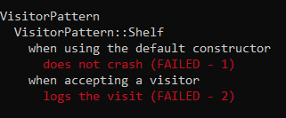
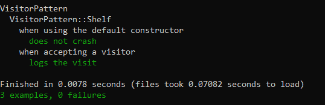
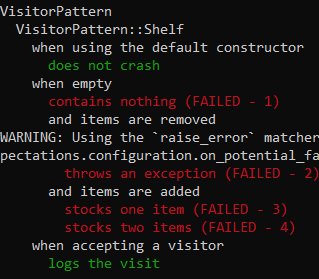
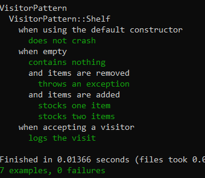
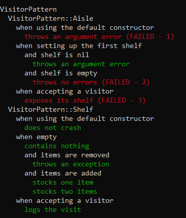
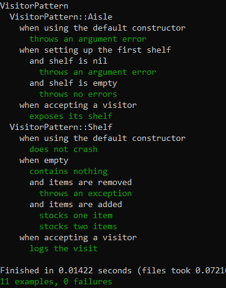
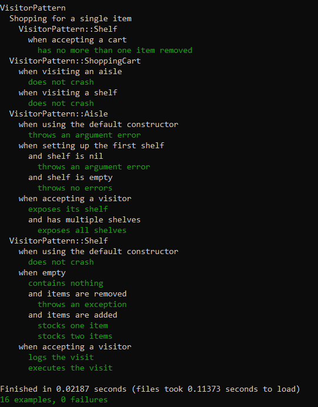

# Overview
- RSpec examples showcasing TDD process and simple design patterns.
- Important code is hand written; any exceptions are documented in code comments.
- Final text output and TDD walkthrough screenshots are included below.

# Index
- `spec` - test code
- `SKETCH.md` - boilerplate from Codex

# Text Output
```text
VisitorPattern
  Shopping for a single item
    VisitorPattern::Shelf
      when accepting a cart
        has no more than one item removed
  VisitorPattern::ShoppingCart
    when visiting an aisle
      does not crash
    when visiting a shelf
      does not crash
  VisitorPattern::Aisle
    when using the default constructor
      throws an argument error
    when setting up the first shelf
      and shelf is nil
        throws an argument error
      and shelf is empty
        throws no errors
    when accepting a visitor
      exposes its shelf
      and has multiple shelves
        exposes all shelves
  VisitorPattern::Shelf
    when using the default constructor
      does not crash
    when empty
      contains nothing
      and items are removed
        throws an exception
      and items are added
        stocks one item
        stocks two items
    when accepting a visitor
      logs the visit
      executes the visit

Finished in 0.01779 seconds (files took 0.08187 seconds to load)
16 examples, 0 failures
```

# TDD Timeline
## TDD 1
Initial failing spec for `VisitorPattern::Shelf`.



## TDD 1 (pass)
`Shelf` baseline behavior passing.



## TDD 2
Failing spec for empty and stocking behavior on `Shelf`.



## TDD 2 (pass)
`Shelf` inventory behavior passing.



## TDD 3
Failing spec introducing `VisitorPattern::Aisle`.



## TDD 3 (pass)
`Aisle` behavior passing.



## TDD 4
Omitted for length.

## TDD 4 (pass)
Final passing spec with shopping cart coverage.


